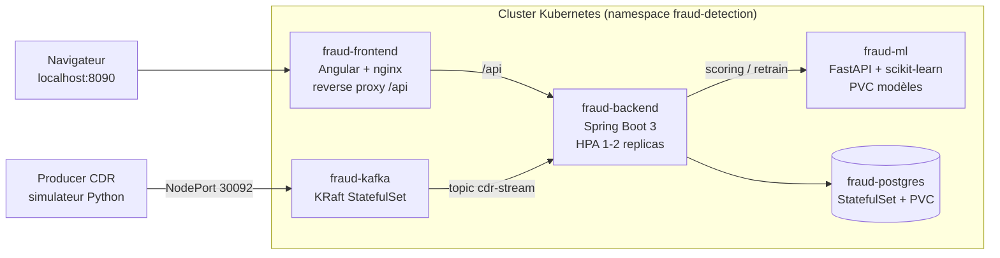

# Plateforme de Détection des Appels Frauduleux

[](https://github.com/iheb137/fraud-detection-platform/actions/workflows/ci.yml)
[](https://hub.docker.com/u/iheb99)
[](https://openjdk.org/)
[](https://spring.io/)
[](https://angular.dev/)
[](infra/k8s/)

Plateforme complète de détection de fraude télécom développée dans le cadre d'un stage ingénieur à la **DSI de Tunisie Telecom** (été 2026). Elle détecte en temps réel les schémas de fraude classiques de l'écosystème opérateur : **IRSF** (International Revenue Share Fraud), **Wangiri**, **SIM Boxing** et **PBX Hacking**.

## Fonctionnalités

- **Ingestion CDR** : import batch (CSV) avec détection de doublons, et **streaming temps réel via Kafka** (batchs virtuels journaliers)
- **Scoring ML** : Random Forest (22 features), seuil configurable, alertes automatiques à 3 niveaux de sévérité
- **Cycle MLOps complet** : labellisation "vérité terrain" par les analystes → export dataset → réentraînement piloté depuis l'UI → comparaison des métriques (AUC, précision, rappel) → **promotion manuelle** avec rechargement à chaud du modèle
- **Isolation par rôle** : ADMIN (ses données), ANALYSTE (périmètre sélectionnable multi-admins, labellisation, interventions ciblées/broadcast), SUPERADMIN (gouvernance : santé plateforme, volumétrie, activité)
- **Exports analyste** : dataset ML (contrat 16 colonnes) et rapport comparatif inter-admins
- **API documentée** : OpenAPI/Swagger avec authentification Bearer JWT

## Architecture



| Composant | Technologie | Rôle |
|---|---|---|
| Backend | Spring Boot 3.5 / Java 17 | API REST, sécurité JWT, consumer Kafka, orchestration ML |
| Frontend | Angular 21 | Dashboards par rôle, imports, alertes, retrain widget |
| Service ML | FastAPI / scikit-learn 1.7 | Scoring, pipeline de réentraînement par phases |
| Base de données | PostgreSQL 18 | CDR, prédictions, alertes, utilisateurs |
| Streaming | Apache Kafka 3.9 (KRaft) | Ingestion temps réel des CDR |
| Orchestration | Kubernetes (8 manifests) | StatefulSets, probes, HPA, Secrets, PVC |
| CI/CD | GitHub Actions → Docker Hub | Tests, builds multi-stage, publication d'images |

## Démarrage rapide

### Prérequis
Docker Desktop (avec Kubernetes activé pour le déploiement cluster), JDK 17, Node 22, Python 3.13+.

### Option A — Déploiement Kubernetes (recommandé)

```bash
# 1. Créer le manifest de secrets à partir du modèle
cp infra/k8s/01-secrets.example.yaml infra/k8s/01-secrets.yaml
#    -> remplacer les valeurs CHANGE_ME

# 2. Déployer
kubectl apply -f infra/k8s/

# 3. Vérifier
kubectl -n fraud-detection get pods
```

Application : http://localhost:8090 — documentation d'exploitation complète (cycle de vie, migration de données, troubleshooting) : [infra/k8s/README.md](infra/k8s/README.md)

### Option B — Dev local

```bash
# Kafka
docker compose -f infra/docker-compose.yml up -d
# Backend (8081), Frontend (4200), ML (8000) : voir scripts start_project.bat
```

### Démo streaming temps réel

```bash
cd ml-service/simulator
python cdr_producer.py --broker localhost:30092 --rate 2   # vers le cluster K8s
```

Les CDR injectés apparaissent en live : ingestion → scoring ML → alertes dans l'UI.

## Tests et qualité

- **19 tests unitaires** (JUnit 5 + Mockito) ciblant les décisions d'architecture : idempotence du consumer Kafka, upsert des prédictions (anti-doublon structurel), résolution de périmètre par rôle
- `mvn test` dans `backend/backend` — exécutés à chaque push/PR par la CI
- Analyse qualité continue : SonarCloud (Automatic Analysis)

## Pipeline CI/CD

À chaque PR : tests backend + build frontend + checks ML. Au merge sur `main` : publication des 3 images ([iheb99/fraud-backend](https://hub.docker.com/r/iheb99/fraud-backend), [iheb99/fraud-ml](https://hub.docker.com/r/iheb99/fraud-ml), [iheb99/fraud-frontend](https://hub.docker.com/r/iheb99/fraud-frontend)) taguées `latest` + SHA du commit.

## Structure du dépôt
## Sécurité

Authentification JWT (secret injecté par variable d'environnement — les valeurs par défaut du code sont réservées au dev), contrôle d'accès par rôle sur chaque endpoint, secrets Kubernetes hors dépôt (modèle `01-secrets.example.yaml`), images non-root.

---

**Iheb Eddine Saafi** — Stage ingénieur, TEK-UP / Tunisie Telecom DSI, été 2026. Encadrant : Nader Slaimi.